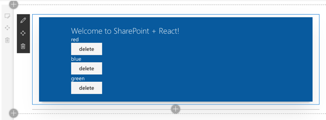

## Leveraging Fabric React

In this demo, you will update the existing React-based SPFx web part to leverage a few controls from the [Fabric React](https://developer.microsoft.com/fabric) controls.

> This project uses the final project from the previous demo as the starting point. A copy of the final project from the previous demo can be found in the **./Demos/01-webpart** folder.

1. Update the project to follow the [recommended guidance from Microsoft when using Fabric React](https://docs.microsoft.com/en-us/sharepoint/dev/spfx/office-ui-fabric-integration#office-ui-fabric-react). This involves removing the reference to the Fabric Core package & changing the existing SCSS reference.
    1. From the command prompt, execute the following command from the root of your project to remove the Fabric Core package:

        ```shell
        npm uninstall @microsoft/sp-office-ui-fabric-core --save
        ```

    1. Open the file **./src/webparts/reactWebPartDemo/components/ReactWebpartDemo.module.scss**.
    1. Change the first line from...

        ```scss
        @import '~@microsoft/sp-office-ui-fabric-core/dist/sass/SPFabricCore.scss';
        ```

        ... to the following:

        ```scss
        @import '~office-ui-fabric-react/dist/sass/_References.scss';
        ```

1. Update the existing **ColorList** React component to leverage Fabric React controls.
    1. Open the **./src/webparts/reactWebPartDemo/components/ColorList.tsx** file.
    1. Add the following `import` statements to the top of the file. These will enable adding a DefaultButton and List control to the component:

        ```ts
        import { List } from 'office-ui-fabric-react/lib/List';
        import { DefaultButton } from 'office-ui-fabric-react/lib/Button';
        ```

    1. Update the `render()` method within the `ColorList` class to the following code:

        ```tsx
        public render(): React.ReactElement<IColorListProps> {
          return (
            <div>
              <List items={ this.props.colors } 
                    onRenderCell={ this._onRenderListCell } 
              />
            </div>
          );
        }
        ```

    1. Handle the rendering of each item in the list by adding the following method to the `ColorList` class:

        ```tsx
        private _onRenderListCell = (color: IColor, index: number | undefined): JSX.Element => {
          return (
            <div>
              { color.title }<br />
              <DefaultButton text="delete"
                            data={ color.id }
                            onClick={ () => this._onButtonClick(color) }
              />
            </div>
          );
        }
        ```

    1. Next, add an event handler for when the button is selected:

        ```tsx
        private _onButtonClick(color:IColor): void {
          console.log('clicked delete for color', color);
        }
        ```

1. Test the project:
    1. Start the local web server using the provided gulp **serve** task:

        ```shell
        gulp serve
        ```

    1. The SharePoint Framework's gulp **serve** task will build the project, start a local web server and launch a browser open to the local SharePoint Workbench.

    1. Add the web part to the workbench. Notice our list of three colors is rendered up exactly as we would expect.

        

    1. Select the **delete** button for one of the colors & examine the browser's JavaScript console, usually located in the browser's developer tools. You should see a log message displayed each time a button is selected:

        

    1. Close the browser and stop the local web server by pressing <kbd>CTRL</kbd>+<kbd>C</kbd> in the command prompt.
